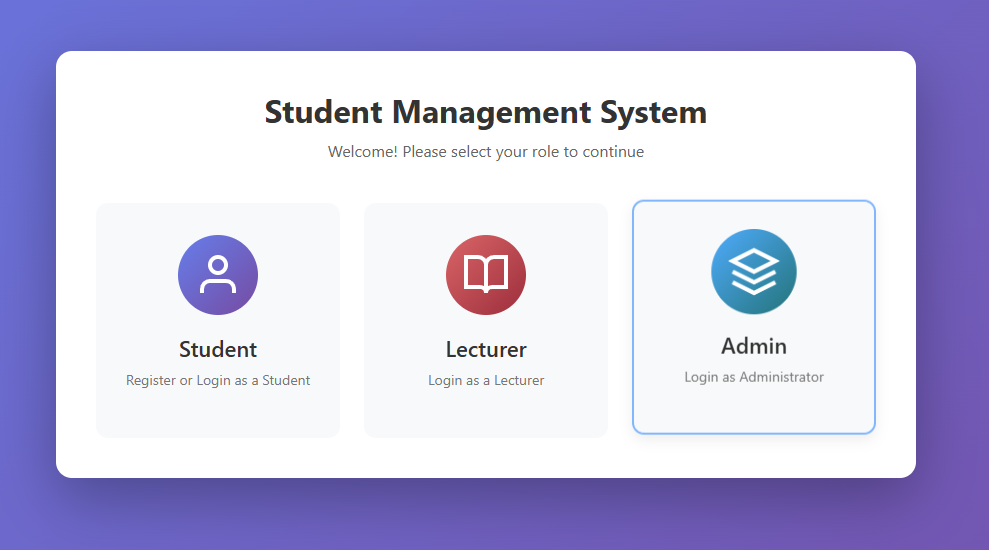
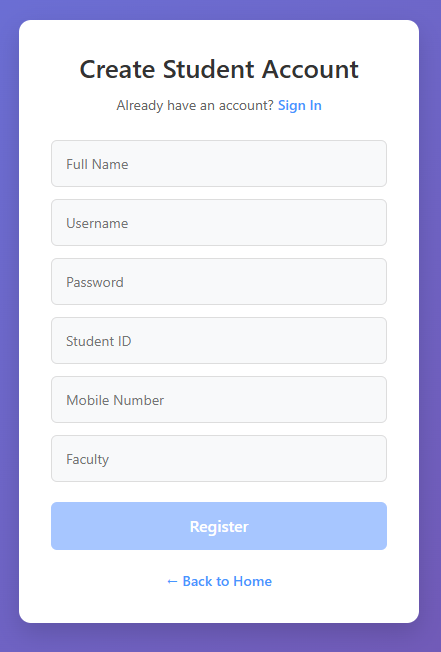
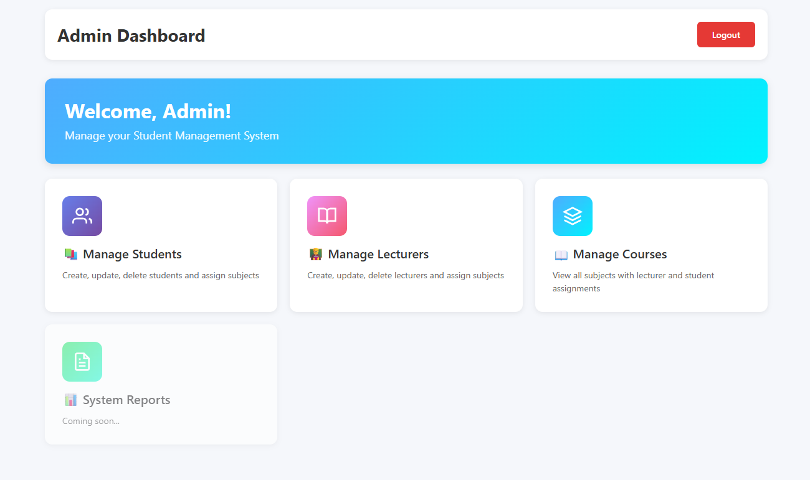
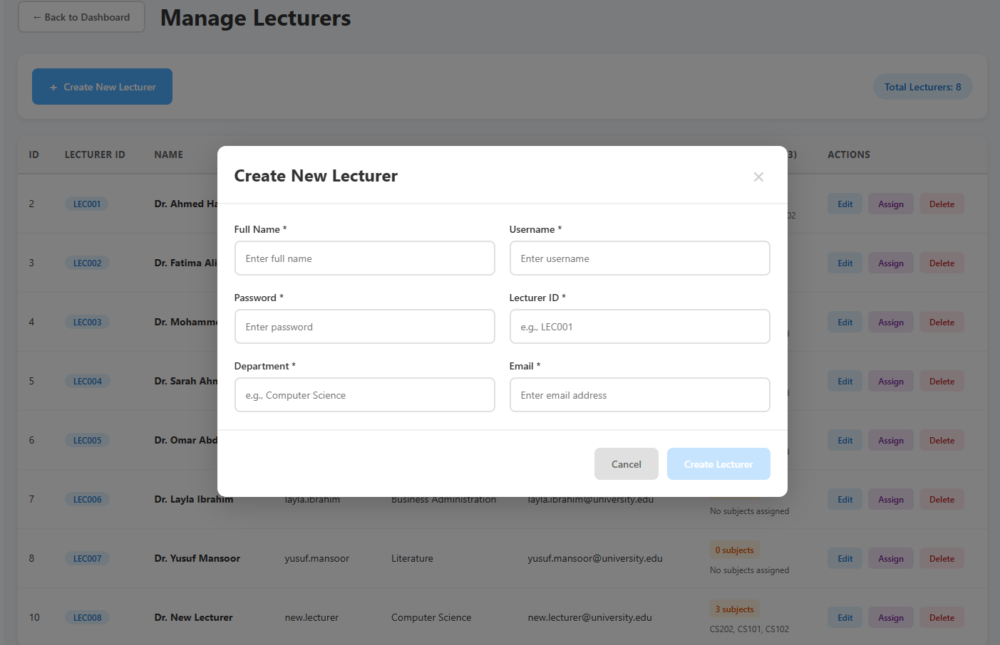
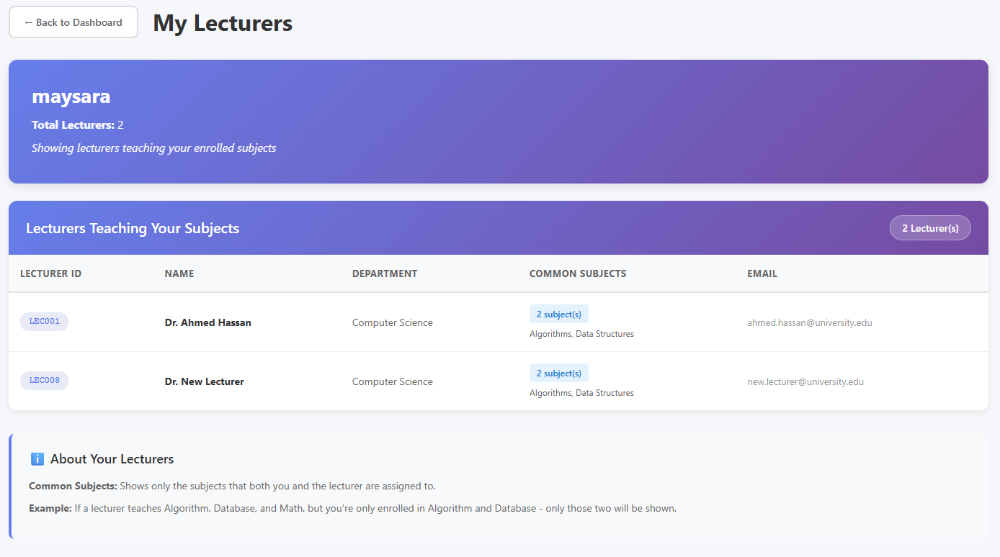
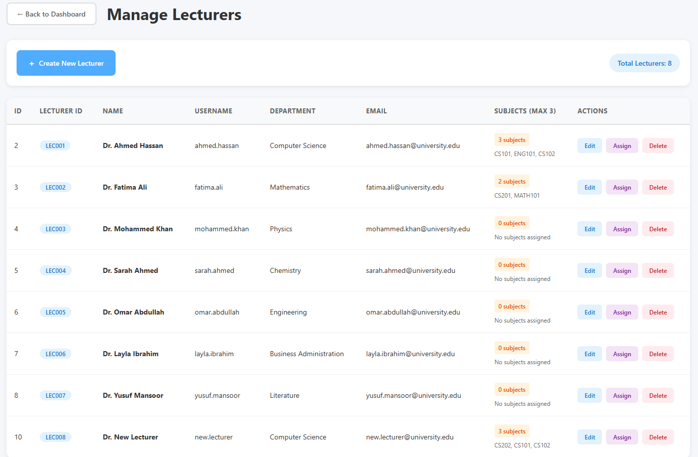
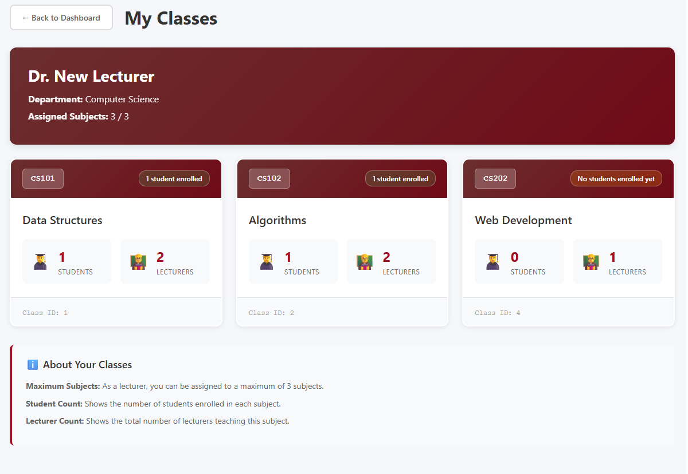

Student Management System
A full-stack web application for managing students, lecturers, and course assignments built with Angular 19 and Spring Boot 4.
Technologies Used
Frontend:

Angular 19
TypeScript
Bootstrap 5
RxJS

Backend:

Spring Boot 4.0.2
Spring Security with JWT
PostgreSQL
JPA/Hibernate

Features
Admin Dashboard

Create, update, and delete students
Create, update, and delete lecturers
Manage courses/subjects
Assign subjects to students (max 5 per student)
Assign subjects to lecturers (max 3 per lecturer)

Lecturer Dashboard

View assigned subjects
View enrolled students
Track student enrollment per subject

Student Dashboard

View enrolled courses
View assigned lecturers
Track course information

Database Schema
The system uses 7 tables:

users - Base table for all users
students - Student-specific information
lecturers - Lecturer-specific information
admins - Admin-specific information
subjects - Course information
student_subjects - Many-to-many relationship
lecturer_subjects - Many-to-many relationship

Authentication

Admin: OAuth-based login (email: maysaracs1001@gmail.com)
Lecturer: Username/password authentication
Student: Registration and login with username/password

All endpoints are secured with JWT tokens and role-based access control.
Installation
Prerequisites

Node.js (v18+)
Java 21
PostgreSQL
Maven

Backend Setup

Create PostgreSQL database:
CREATE DATABASE student_management;

Update application.properties:
spring.datasource.url=jdbc:postgresql://localhost:5432/student-management
spring.datasource.username=your_username
spring.datasource.password=your_password

Run Spring Boot application:
cd student-management-spring-boot
mvn spring-boot:run


Backend runs on http://localhost:8080
Frontend Setup

Install dependencies:

bashcd student-management-angular
npm install

Run Angular application:

ng serve
```

Frontend runs on `http://localhost:4200`

## API Endpoints

### Authentication
- `POST /api/auth/admin/login` - Admin login
- `POST /api/auth/lecturer/login` - Lecturer login
- `POST /api/auth/student/register` - Student registration
- `POST /api/auth/student/login` - Student login

### Admin
- `GET /api/admin/students` - Get all students
- `POST /api/admin/students` - Create student
- `PUT /api/admin/students/{id}` - Update student
- `DELETE /api/admin/students/{id}` - Delete student
- `GET /api/admin/lecturers/with-subjects` - Get all lecturers
- `POST /api/admin/lecturers` - Create lecturer
- `POST /api/admin/assign/student` - Assign subjects to student
- `POST /api/admin/assign/lecturer` - Assign subjects to lecturer

### Lecturer
- `GET /api/lecturer/my-subjects` - Get lecturer's subjects
- `GET /api/lecturer/my-students` - Get students in lecturer's classes

### Student
- `GET /api/student/my-subjects` - Get student's enrolled courses
- `GET /api/student/my-lecturers` - Get lecturers teaching student's courses

### Subjects
- `GET /api/subjects` - Get all subjects
- `POST /api/subjects` - Create subject (admin only)

## Screenshots

### Landing Page


### Login Page


### Admin Dashboard


### Manage Students


### Lecturer Dashboard


### Student Dashboard


### lecturer subject


## Project Structure
```
student-management-system/
├── student-management-angular/
│   ├── src/
│   │   ├── app/
│   │   │   ├── components/
│   │   │   ├── service/
│   │   │   ├── models/
│   │   │   └── app.routes.ts
│   │   └── styles.css
│   └── package.json
└── student-management-spring-boot/
    ├── src/
    │   ├── main/
    │   │   ├── java/com/studentManagement/
    │   │   │   ├── controller/
    │   │   │   ├── service/
    │   │   │   ├── entity/
    │   │   │   ├── repository/
    │   │   │   └── dto/
    │   │   └── resources/
    │   │       └── application.properties
    └── pom.xml


